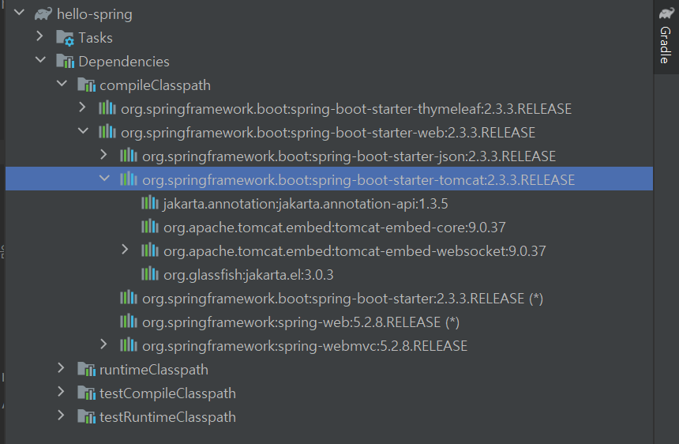
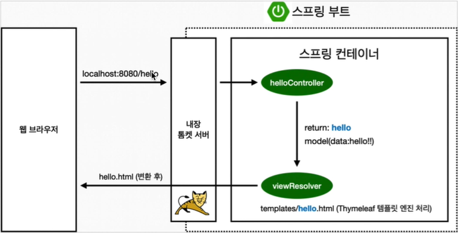
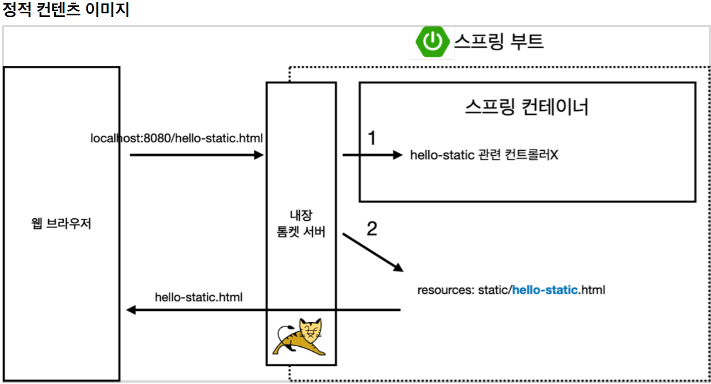
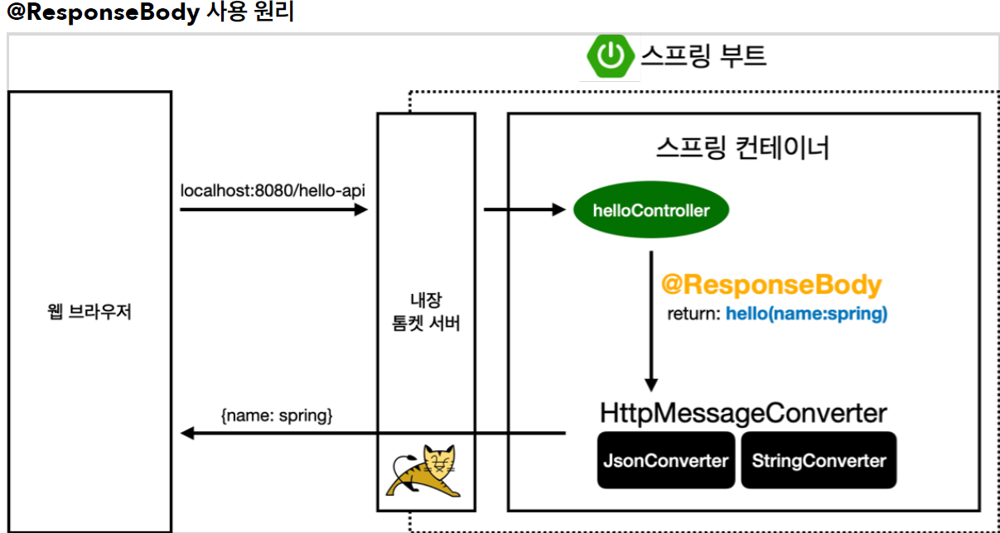

# Springboot introduction

인프런 인강들으면서 스프링부트 입문하기

## Spring project setting

[spring project 생성](start.spring.io)

> Project

+ Maven
+ Gradle

필요한 library를 가져오고 bulid의 lifecycle까지 관리해주는 tool

요즘에는 Gradle을 많이 사용한다.

> Spring boot version

snapshot: 만들고 있음
m*: 정식 릴리즈가 안된 버전

> Project Metadata

+ group: 기업명
+ artifact: 빌드되어 나온 결과물(프로젝트 명)

> Dependencies

+ 어떤 라이브러리를 땡겨서 쓸 것인가?

탬플릿 엔진: html을 만들어 주는 역할

**파일 구조**

```
`-- hello-spring
    |-- idea - intellj 설정 파일
    |-- gradle - gradle 관련 폴더
    |   `-- wrapper
    `-- src
        |-- main
        |   |-- java
        |   |   `-- HELLO
        |   |       `-- hellospring
        |   `-- resources - 자바이외의 파일들이 여기 들어간다
        |       |-- static
        |       `-- templates
        `-- test - 테스트코드들이 들어가 있음
            `-- java
                `-- HELLO
                    `-- hellospring
```

+ bulid.gradle

ruby의 gemfile과 같은 역할임

```
plugins {
	id 'org.springframework.boot' version '2.3.3.RELEASE' // springboot version
	id 'io.spring.dependency-management' version '1.0.10.RELEASE'
	id 'java'
}

group = 'HELLO'
version = '0.0.1-SNAPSHOT'
sourceCompatibility = '11' // java 11 version

repositories {
	mavenCentral() // 라이브러리를 다운로드 받는 사이트를 지정, 특정 사이트 url넣을 수 있음
}

dependencies { // start.spring.io에서 선택한 것들이 여기에 들어감
	implementation 'org.springframework.boot:spring-boot-starter-thymeleaf' // templete engine
	implementation 'org.springframework.boot:spring-boot-starter-web' // web project
	testImplementation('org.springframework.boot:spring-boot-starter-test') { // junit - test를 위한 라이브러리
		exclude group: 'org.junit.vintage', module: 'junit-vintage-engine'
	}
}

test {
	useJUnitPlatform()
}
```

**실행**

```
Tomcat started on port(s): 8080 (http) with context path ''
```

`localhost:8080`

**라이브러리 살펴보기**

`라이브러리가 의존한다.`

> 실행하기위해 필요한 라이브러리를 땡겨온다.

ex) spring-boot-web을 우리가 선택하고 시작했는데 이 spring-boot-web라이브러리는 spring-start-tomcat, spring-start-core등의 라이브러리가 필요하다.   
    즉, spring-boot-web은 spring-boot-tomcat에 의존한다고 말할 수 있다.

external libraries에서 확인할 수 있다.

<div align ="center">



</div>

자세한 내용은 pdf를 참고하자

## view 환경설정

1. welcome page(index page)

+ html파일 위치
    - resources/static

2. 스프링 부트가 제공하는 welcome page 기능
   + `static/index.html`을 올려두면 자동적으로 기능제공
   + 없는 경우, index templete을 찾는다.

3. 링크

[spring docs](https://docs.spring.io/spring-boot/docs/2.3.1.RELEASE/reference/html/spring-bootfeatures.html#boot-features-spring-mvc-welcome-page)

+ thymeleaf 템플릿 엔진

[thymeleaf 공식 사이트](https://www.thymeleaf.org/)
[스프링 공식 튜토리얼](https://spring.io/guides/gs/serving-web-content/)
[스프링부트 메뉴얼](https://docs.spring.io/spring-boot/docs/2.3.1.RELEASE/reference/html/spring-boot-features.html#boot-features-spring-mvc-template-engines)

**controller**

1. controller만들기
java/HELLO.hellospring위치에서,   
controller package생성후 HelloController클래스 생성   

```java
package HELLO.hellospring.controller;

import org.springframework.stereotype.Controller;
import org.springframework.ui.Model;
import org.springframework.web.bind.annotation.GetMapping;

@Controller
public class HelloController {
    // http의 get method이다. 우리가 url을 치고 던져주면 그것은 get방식이다.
    @GetMapping("hello") // localhost:8080/hello와 매핑하게 만들어주는 annotation
    public String hello(Model model) { // MVC모델에서의 Model
        model.addAttribute("data", "hello!!");// 인자로 받은 model에 data라는 key에 | hello!!라는 값을 넣는다. 
        return "hello"; // resources/templetes의 hello.html로 넘어가라
    }
}
```



+ 컨트롤러에서 리턴 값으로 문자를 반환하면 뷰 리졸버( viewResolver )가 화면을 찾아서 처리한다.
    + 스프링 부트 템플릿엔진 기본 viewName 매핑
    + resources:templates/ +{ViewName}+ .html

**terminal로 server 실행하기**

bulid와 실행

```bash

$ ./gradlew bulid

$ cd build/libs

$ java -jar hello-spring-0.0.1-SNAPSHOT.jar

```

bulid 삭제 후 재생성

```bash
$ ./gradlew clean bulid

$ cd build/libs

$ java -jar hello-spring-0.0.1-SNAPSHOT.jar
```

## spring web 개발 기초

`크게 3가지 방식이 있다.`

> 정적 컨텐츠

+ 서버에서 하는 것 없이 파일을 그대로 브라우저로 전송

> MVC와 템플릿 엔진

+ JSP, PHP가 소위 말하는 Templete engine인데, server에서 프로그래밍된 결과가 반영되어 html을 동적으로 만듦

> API

+ Json을 client로 전달하는 방식, react나 viewjs와 같은 것들은 json을 받아 화면을 그린다.
+ server끼리 통신할 때

**정적컨텐츠**

resources/static 위치에 html파일을 생성하면 된다.



**MVC와 템플릿 엔진**

resources/template 위치에 html을 넣고

controller를 맞게 만들어 준다.

```java
@GetMapping("hello-mvc") // loacalhost:8080/hello-mvc
// view를 그리기 위해 params를 넘겨야 한다. url 요청자가 params를 넘겨야한다.
// localhost:8080/hello-mvc?name=content
    public String helloMvc(@RequestParam("name") String name, Model model){ 
        model.addAttribute("name", name); // name이라는 key에 들어온 내용을 저장
        return "hello-template"; // hello-template.html로 이동
    }
```

**API 방식**

@ResponseBody 를 사용
HTTP의 BODY에 문자 내용을 직접 반환
viewResolver 대신에 HttpMessageConverter 가 동작
기본 문자처리: StringHttpMessageConverter
기본 객체처리: MappingJackson2HttpMessageConverter (Jackson2는 객체를 json으로 바꾸는 library)
byte 처리 등등 기타 여러 HttpMessageConverter가 기본으로 등록되어 있음

> 참고: 클라이언트의 HTTP Accept 해더와 서버의 컨트롤러 반환 타입 정보 둘을 조합해서
HttpMessageConverter 가 선택된다.

+ @ResponseBody 문자 반환

```java
public class HelloController {
    @GetMapping("hello-string")
    @ResponseBody
    public String helloString(@RequestParam("name") String name) {
    return "hello " + name;
    }
}
```

@ResponseBody 를 사용하면 뷰 리졸버( viewResolver )를 사용하지 않음
대신에 HTTP의 BODY에 문자 내용을 직접 반환(HTML BODY TAG를 말하는 것이 아님)

실행
http://localhost:8080/hello-string?name=spring

+ @ResponseBody 객체 반환

```java
@Controller
public class HelloController {
    @GetMapping("hello-api")
    @ResponseBody
    public Hello helloApi(@RequestParam("name") String name) {
        Hello hello = new Hello();
        hello.setName(name);
        return hello;
    }
    static class Hello {
        private String name;
        public String getName() {
            return name;
        }
        public void setName(String name) {
            this.name = name;
        }
    }
}
```

@ResponseBody 를 사용하고, 객체를 반환하면 객체가 JSON으로 변환됨

